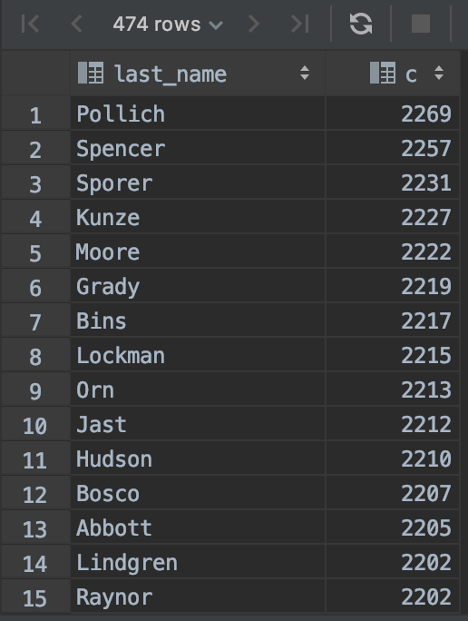
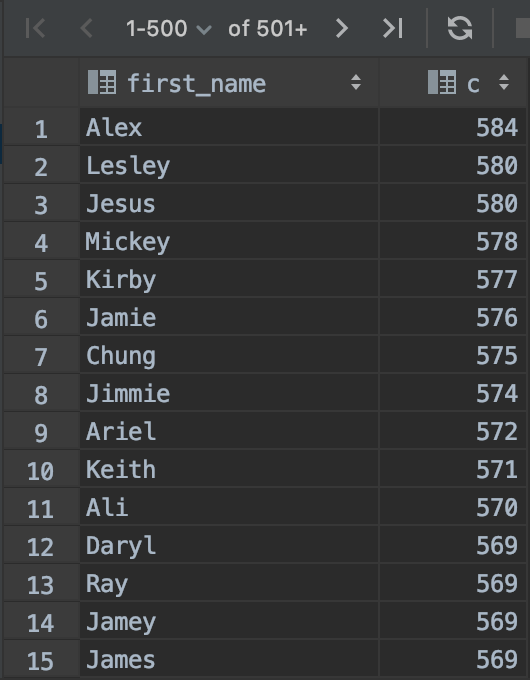
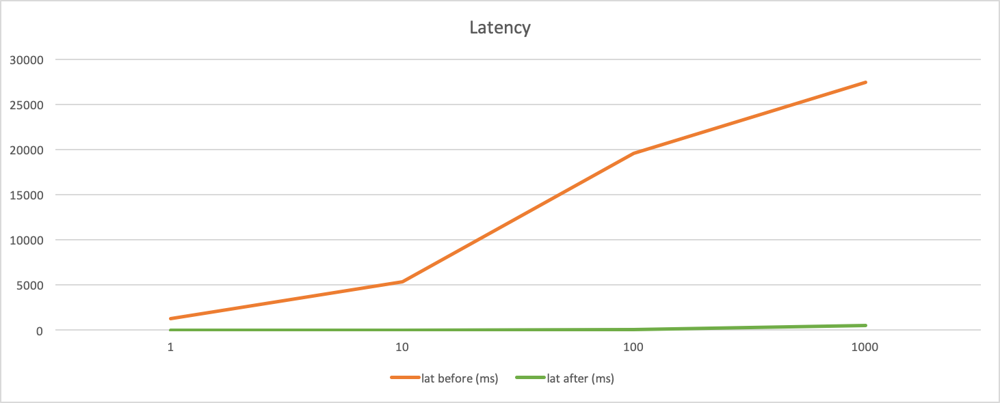

## 1. Генерация данных
Для генерации данных был написан скрипт, который дергает API

```
./util/fake-data/bin/generate_1_000_000_users
```

## 2. НТ 
Для проведения НТ написаны скрипты
```
./util/wrk/bin
```

## 3. Результаты НТ без индекса
```
a17636999@CAB-WSM-0007463 bin % ./run_wrk_1
Running 30s test @ http://127.0.0.1:8080
  1 threads and 1 connections
  Thread Stats   Avg      Stdev     Max   +/- Stdev
    Latency     1.25s    80.67ms   1.49s    87.50%
    Req/Sec     0.00      0.00     0.00    100.00%
  24 requests in 30.01s, 8.11KB read
Requests/sec:      0.80
Transfer/sec:     276.68B

a17636999@CAB-WSM-0007463 bin % ./run_wrk_10
Running 30s test @ http://127.0.0.1:8080
  2 threads and 10 connections
  Thread Stats   Avg      Stdev     Max   +/- Stdev
    Latency     5.39s   243.95ms   5.65s    76.00%
    Req/Sec     9.18     12.99    38.00     82.35%
  50 requests in 30.10s, 16.89KB read
Requests/sec:      1.66
Transfer/sec:     574.73B


a17636999@CAB-WSM-0007463 bin % ./run_wrk_100
Running 30s test @ http://127.0.0.1:8080
  4 threads and 100 connections
  Thread Stats   Avg      Stdev     Max   +/- Stdev
    Latency    19.58s     9.21s   30.09s    41.67%
    Req/Sec     9.88     17.93    70.00     85.29%
  72 requests in 30.10s, 200.72KB read
  Non-2xx or 3xx responses: 12
Requests/sec:      2.39
Transfer/sec:      6.67KB

Running 30s test @ http://127.0.0.1:8080
  6 threads and 1000 connections
  Thread Stats   Avg      Stdev     Max   +/- Stdev
    Latency    27.42s     2.46s   29.49s    58.82%
    Req/Sec     4.33     10.07    30.00     88.89%
  17 requests in 30.10s, 5.74KB read
  Socket errors: connect 0, read 1196, write 0, timeout 0
Requests/sec:      0.56
Transfer/sec:     195.44B

```
## 4. Какой индекс нужен и почему
- Логично сделать составной индекс по колонкам last_name и first_name, так как мы ищем сразу по ним двум ( ! по префиксу ). 
- Для ускоренее работы индекса, первым в индексе должна идти та колонка, у которой селективность выше. 
- ~~Руководствуясь здравым смыслом и исходя из сгенеренных данных, примем что last_name более "уникально", чем first_name. Поэтому ее и поставим первым в индексе.~~
- Для определения селективности, необходимо посчитать кол-во уникальный значений в наших колонках.

#### last_name 
```mysql
SELECT count(DISTINCT last_name) FROM users;
-- 474
```
```mysql
select last_name, count(1) as c FROM users GROUP BY last_name order by c desc;
```



#### first_name
```mysql
SELECT count(DISTINCT first_name) FROM users;
-- 5165
```
```mysql
select first_name, count(1) as c FROM users GROUP BY first_name order by c desc;
```


1. last_name имеет 474 уникальных записей и в среднем на одно уникальное значение last_name приходится около 2000 записей
2. first_name имеет 5165 уникальных записей и в среднем на одно уникальное значение first_name приходится около 500 записей
  
Исходя из этого, селективность first_name выше чем у last_name. Поэтому fist_name будет идти первым в индексе
```mysql
CREATE INDEX I_user_ON_first_name_last_name ON users(first_name, last_name);
```

## 5. Результаты НТ после индекса
```
+ wrk -t1 -c1 -d30s -s /Users/a17636999/Projects/social-network/util/wrk/gen_and_search.lua --timeout 100s http://127.0.0.1:8080
Running 30s test @ http://127.0.0.1:8080
  1 threads and 1 connections
  Thread Stats   Avg      Stdev     Max   +/- Stdev
    Latency     2.39ms    5.99ms 150.04ms   99.11%
    Req/Sec   512.66    135.81   757.00     62.88%
  15281 requests in 30.04s, 5.24MB read
Requests/sec:    508.62
Transfer/sec:    178.66KB


+ wrk -t6 -c10 -d30s -s /Users/a17636999/Projects/social-network/util/wrk/gen_and_search.lua --timeout 100s http://127.0.0.1:8080
Running 30s test @ http://127.0.0.1:8080
  6 threads and 10 connections
  Thread Stats   Avg      Stdev     Max   +/- Stdev
    Latency     5.76ms    8.87ms 201.80ms   91.40%
    Req/Sec   226.25     79.67   505.00     68.10%
  40492 requests in 30.09s, 14.00MB read
Requests/sec:   1345.75
Transfer/sec:    476.40KB

+ wrk -t6 -c100 -d30s -s /Users/a17636999/Projects/social-network/util/wrk/gen_and_search.lua --timeout 100s http://127.0.0.1:8080
Running 30s test @ http://127.0.0.1:8080
  6 threads and 100 connections
  Thread Stats   Avg      Stdev     Max   +/- Stdev
    Latency    71.27ms   25.99ms 359.89ms   80.96%
    Req/Sec   226.71     60.31   420.00     65.89%
  40733 requests in 30.09s, 14.10MB read
Requests/sec:   1353.75
Transfer/sec:    479.93KB

+ wrk -t6 -c1000 -d30s -s /Users/a17636999/Projects/social-network/util/wrk/gen_and_search.lua --timeout 100s http://127.0.0.1:8080
Running 30s test @ http://127.0.0.1:8080
  6 threads and 1000 connections
  Thread Stats   Avg      Stdev     Max   +/- Stdev
    Latency   552.39ms  189.89ms   1.10s    69.27%
    Req/Sec   253.74     61.52   460.00     65.83%
  45434 requests in 30.05s, 15.31MB read
  Socket errors: connect 0, read 1078, write 0, timeout 0
Requests/sec:   1512.19
Transfer/sec:    521.73KB

```

## 6. Графики



